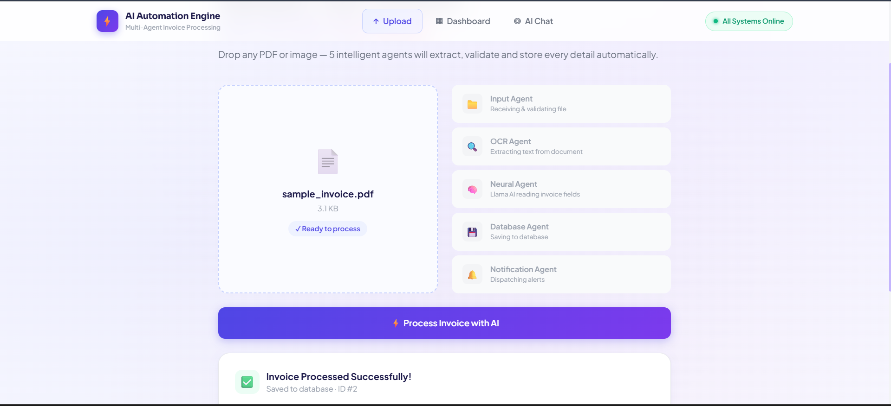
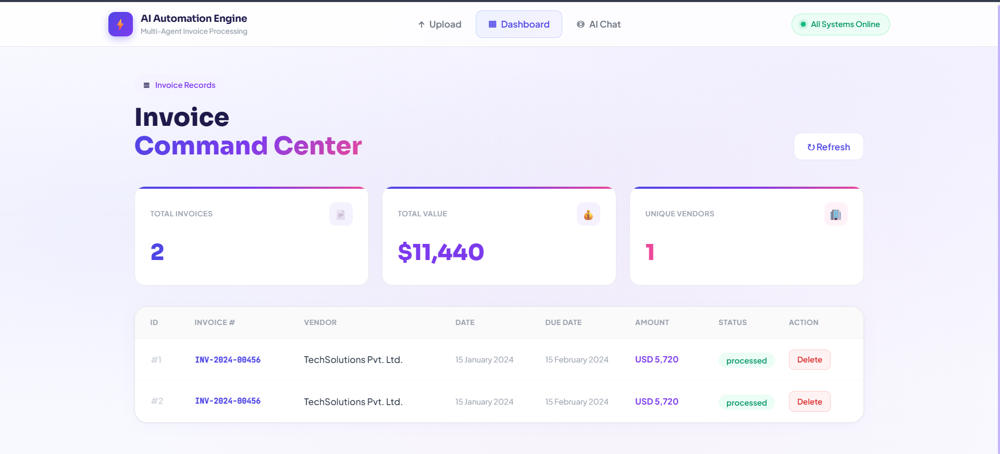
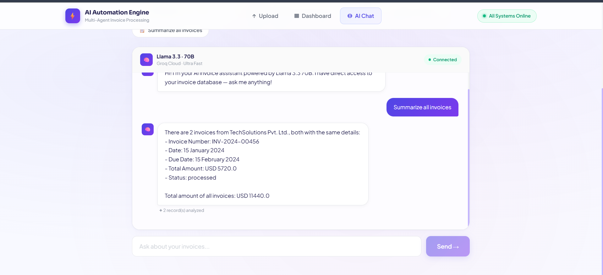

# ⚡ AI Business Automation Engine
### Multi-Agent Invoice Processing System


> A production-ready AI-powered invoice processing system that automatically extracts, validates, stores and analyzes invoice data using a multi-agent architecture.

🌐 **Live Demo:** [https://sensational-pie-ca9218.netlify.app](https://sensational-pie-ca9218.netlify.app)
🔌 **API Docs:** [https://ai-business-automation-engine-production.up.railway.app/docs](https://ai-business-automation-engine-production.up.railway.app/docs)

---

## 🎯 What It Does

Upload any invoice (PDF or image) and 5 AI agents automatically:

1. **Validate** the file format and save it
2. **Extract** all text using OCR or Groq Vision AI
3. **Read & Structure** invoice fields using Llama 3.3 70B
4. **Store** everything in a database
5. **Notify** via email (optional)

Then **chat with your invoice database** in plain English — ask about overdue invoices, total amounts, vendor summaries and more.

---

## 🤖 Multi-Agent Architecture

```
📄 Invoice Upload
      │
      ▼
┌─────────────────┐
│  Input Agent    │ ── Validates file type (PDF/PNG/JPG)
└────────┬────────┘
         │
         ▼
┌─────────────────┐
│   OCR Agent     │ ── Extracts text (pypdfium2 for PDF, Groq Vision for images)
└────────┬────────┘
         │
         ▼
┌─────────────────┐
│Validation Agent │ ── Llama 3.3 70B extracts structured fields via Groq
└────────┬────────┘
         │
         ▼
┌─────────────────┐
│ Database Agent  │ ── Saves to SQLite database
└────────┬────────┘
         │
         ▼
┌─────────────────┐
│Notification Agent│ ── Sends email alert (Gmail SMTP)
└─────────────────┘
         │
         ▼
✅ Pipeline Complete
```

---

## 🛠️ Tech Stack

### Backend
| Technology | Purpose |
|---|---|
| **FastAPI** | REST API framework |
| **Groq API** | LLM inference (Llama 3.3 70B) |
| **Groq Vision** | Image OCR (Llama 4 Scout) |
| **pypdfium2** | PDF text extraction |
| **SQLAlchemy** | ORM & database management |
| **SQLite** | Database storage |
| **Loguru** | Structured logging |

### Frontend
| Technology | Purpose |
|---|---|
| **React + Vite** | UI framework |
| **Tailwind CSS** | Styling |
| **Axios** | API communication |

### Infrastructure
| Service | Purpose |
|---|---|
| **Railway** | Backend deployment |
| **Netlify** | Frontend deployment |
| **GitHub** | Version control |

---

## 🚀 Features

- ✅ **PDF & Image Support** — Upload PDF, PNG, JPG invoices
- ✅ **AI OCR** — Groq Vision model reads image invoices
- ✅ **LLM Extraction** — Llama 3.3 70B extracts structured data
- ✅ **Auto Invoice Number** — Generates ID if invoice number missing
- ✅ **Invoice Dashboard** — View all processed invoices with stats
- ✅ **Delete Invoices** — Remove unwanted records
- ✅ **AI Chat** — Ask questions about your invoices in plain English
- ✅ **Email Notifications** — Optional Gmail alerts on processing
- ✅ **REST API** — Full Swagger UI documentation
- ✅ **Live Deployment** — Fully deployed on Railway + Netlify

---

## 📡 API Endpoints

| Method | Endpoint | Description |
|---|---|---|
| `GET` | `/` | Health check |
| `GET` | `/health` | System status |
| `POST` | `/upload` | Upload & process invoice |
| `GET` | `/invoices` | List all invoices |
| `DELETE` | `/invoices/{id}` | Delete invoice |
| `POST` | `/chat` | Chat with invoice database |

---

## ⚙️ Local Setup

### Prerequisites
- Python 3.12+
- Node.js 18+
- Groq API Key (free at [console.groq.com](https://console.groq.com))

### Backend Setup

```bash
# Clone the repo
git clone https://github.com/YoushaLashari/AI-Business-Automation-Engine.git
cd AI-Business-Automation-Engine

# Create virtual environment
python -m venv venv
venv\Scripts\activate  # Windows
source venv/bin/activate  # Mac/Linux

# Install dependencies
cd backend
pip install -r requirements.txt

# Create .env file
cp .env.example .env
# Add your GROQ_API_KEY to .env

# Run the server
uvicorn main:app --reload --host 0.0.0.0 --port 8000
```

### Frontend Setup

```bash
cd frontend
npm install
npm run dev
```

Visit `http://localhost:5173` 🚀

---

## 🔑 Environment Variables

Create `backend/.env` with:

```env
GROQ_API_KEY=your_groq_api_key_here
DATABASE_URL=sqlite:///./invoices.db
EMAIL_SENDER=your_email@gmail.com
EMAIL_PASSWORD=your_app_password
EMAIL_RECEIVER=receiver@gmail.com
```

---

## 📸 Screenshots

### Upload Invoice
> Upload any PDF or image — AI agents process it automatically


### Invoice Dashboard  
> View all processed invoices with stats and delete functionality

### AI Chat
> Ask questions about your invoices in plain English



---

## 🏗️ Project Structure

```
AI-Business-Automation-Engine/
├── backend/
│   ├── agents/
│   │   ├── input_agent.py        # File validation & saving
│   │   ├── ocr_agent.py          # Text extraction (PDF + Vision)
│   │   ├── validation_agent.py   # LLM field extraction
│   │   ├── database_agent.py     # SQLite operations
│   │   ├── notification_agent.py # Email alerts
│   │   └── chat_agent.py         # Invoice Q&A
│   ├── main.py                   # FastAPI app & endpoints
│   ├── orchestrator.py           # Pipeline coordinator
│   ├── models.py                 # Database models
│   ├── config.py                 # Environment config
│   └── requirements.txt
├── frontend/
│   ├── src/
│   │   ├── components/
│   │   │   ├── Upload.jsx        # Invoice upload UI
│   │   │   ├── Dashboard.jsx     # Invoice table & stats
│   │   │   └── Chat.jsx          # AI chat interface
│   │   ├── App.jsx
│   │   └── index.css
│   └── package.json
└── sample_data/
    └── sample_invoice.pdf
```

---

## 👨‍💻 Author

**Yousha Lashari**
- GitHub: [@YoushaLashari](https://github.com/YoushaLashari)
- Built as a portfolio project for AI automation freelancing

---

## 📄 License

MIT License — feel free to use this project as a reference or template.

---

*Built with ❤️ using FastAPI, React, Groq & Llama 3.3 70B*
